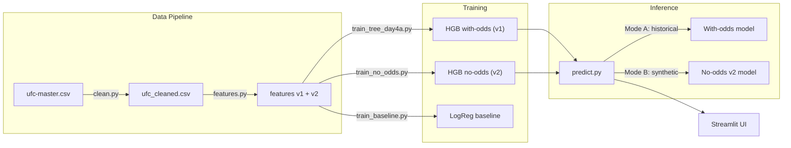
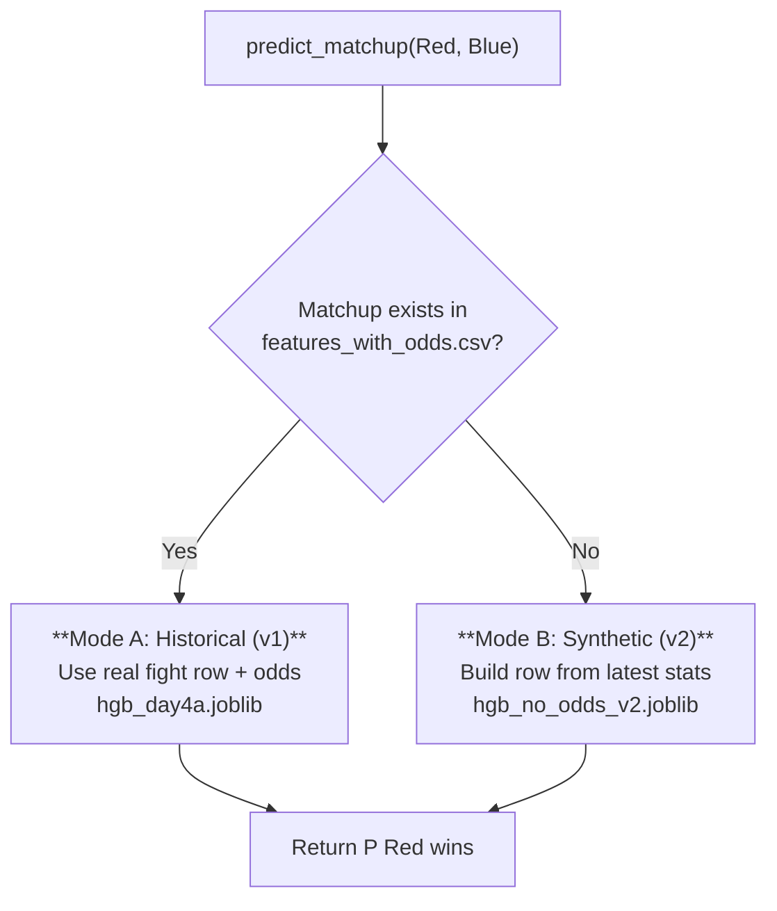
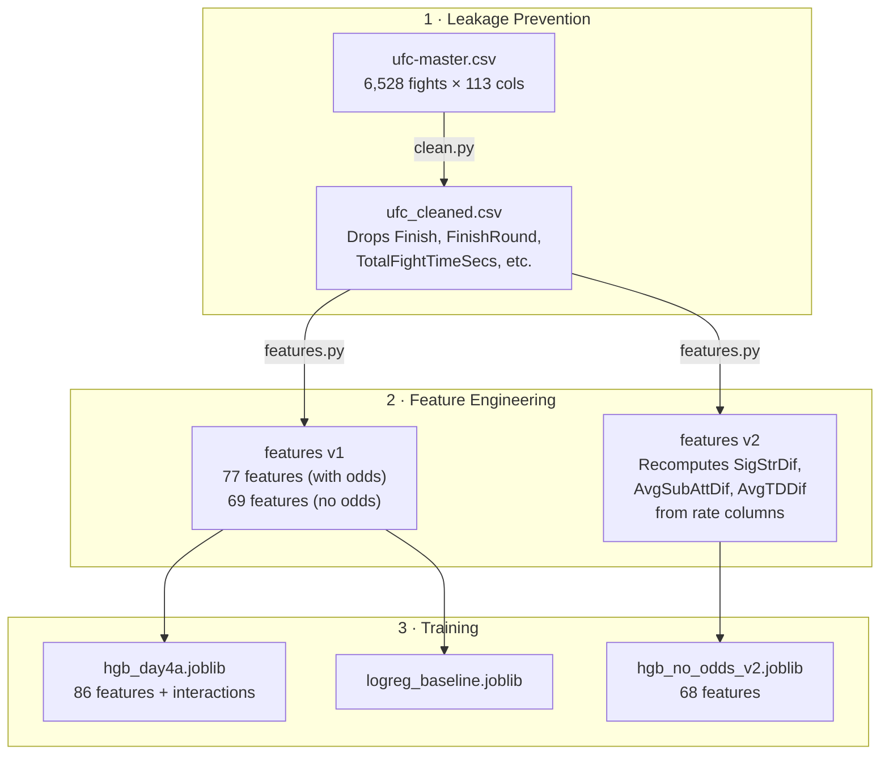

# 🥊 FightSense AI — UFC Fight Outcome Predictor

A machine learning system that predicts UFC fight outcomes using pre-fight statistics, historical data, and betting odds. Supports both **historical backtesting** and **hypothetical/upcoming matchup prediction** via a dual-mode inference engine.

> **6,528 fights** · **74+ differential features** · **Time-based evaluation** · **Streamlit Web UI**

---

## Model Card (Summary)

### Intended Use

Predict UFC fight outcomes using historical pre-fight statistics. Two modes:

- **Mode A — Historical backtest**: uses a real bout row from the dataset with betting odds → `hgb_day4a_v1_with_odds`
- **Mode B — Synthetic matchup**: builds a matchup from each fighter's latest career stats, no odds required → `hgb_no_odds_v2`

### Data & Features

- **6,528 fights** (2010–2024) from publicly available UFC statistics
- Post-fight columns removed to prevent data leakage (`Finish`, `FinishRound`, `TotalFightTimeSecs`, etc.)
- 74+ differential features: physical stats, career records, striking/grappling rates, rankings, stance matchups, weight class, and fight context
- Betting odds features are optional and dominate predictive power when available

### Evaluation

- **Time-based split** (no shuffle): train on older fights (80%), test on newer fights (20%)
- Train: 5,222 fights (2010–2022) · Test: 1,306 fights (2022–2024)
- Metrics: accuracy, ROC-AUC, log loss, Brier score

### Key Findings

- **Odds-only baseline is strongest** (AUC 0.723) — consistent with betting market efficiency
- **v2 rate-based diffs** improved the no-odds model (+0.005 AUC) by aligning feature definitions with what the synthetic builder produces
- **Close-odds fights** behave near coin flip, consistent with market uncertainty

### Limitations

- **Cross-division hypotheticals are out-of-distribution**: the model was never trained on HW-vs-FW style matchups. The UI blocks these by default
- **Synthetic mode lacks betting lines**: uses a weaker no-odds model (AUC 0.605 vs 0.692)
- **Dataset-specific feature schema**: schema locking prevents feature drift, but the model is tied to this particular dataset's column definitions
- **Not betting advice**: this is a portfolio/learning project, not a wagering system

---

## Architecture Overview



---

## Quick Start

```bash
# 1. Clone and install
git clone https://github.com/NerdNek/ufc-fight-predictor.git
cd ufc-fight-predictor
pip install -r requirements.txt

# 2. Place ufc-master.csv in data/raw/

# 3. Run the full pipeline
python src/clean.py                # Remove leakage columns
python src/features.py             # Generate v1 + v2 differential features
python src/train_tree_day4a.py     # Train with-odds HGB model
python src/train_no_odds.py --input data/processed/features_no_odds_v2.csv --out-suffix _v2

# 4. Launch the web UI
streamlit run streamlit_app.py

# Or predict from the command line
python src/predict.py --red "Islam Makhachev" --blue "Jon Jones"
```

---

## Prediction Modes

The predictor automatically selects a mode based on whether the fighter pair exists in the historical dataset.



### Mode A — Historical (with-odds, v1)

Uses the real fight-level row with actual betting odds for maximum backtesting fidelity.

- **Model**: `hgb_day4a.joblib` — 86 features, ROC-AUC **0.692**
- **Includes**: odds-gated interaction features (close-odds gates, favorite/underdog gates)
- **Best for**: validating model performance on known fights

### Mode B — Synthetic (no-odds, v2)

Constructs a synthetic feature row from each fighter's most recent career stats. Uses the **v2 model** trained on rate-based differential features that match the synthetic builder's scale.

- **Model**: `hgb_no_odds_v2.joblib` — 68 features, ROC-AUC **0.605**
- **Includes**: OOD guardrail that clips extreme diff values before prediction
- **Best for**: upcoming or hypothetical matchups (no betting lines needed)
- **Supports**: optional weight class, title bout, and round count context

---

## Model Performance

### Evaluation Methodology

| Detail | Value |
| --- | --- |
| **Split** | Time-based (no shuffle) — train on past, test on future |
| **Train** | 5,222 fights (2010-03-21 → 2022-05-21) |
| **Test** | 1,306 fights (2022-05-21 → 2024-12-07) |

### Results

| Model | Accuracy | ROC-AUC | Log Loss | Notes |
| --- | --- | --- | --- | --- |
| Majority Class (always Red) | 56.28% | — | — | Baseline |
| **Odds Only (LogReg)** | **66.85%** | **0.723** | — | Market efficiency ceiling |
| LogReg v1 (77 features) | 62.94% | 0.699 | — | |
| LogReg v2 (73 features) | 63.55% | 0.699 | — | Rate-based diffs |
| HGB Odds-Only | 63.25% | 0.678 | 0.64 | |
| HGB Skill-Only v1 | 59.19% | 0.598 | 0.68 | |
| HGB Skill-Only v2 | 59.72% | 0.604 | — | ↑ +0.006 AUC |
| HGB Full v1 (86 features) | 63.17% | 0.692 | 0.64 | Mode A model |
| HGB No-Odds v1 (68 features) | 58.42% | 0.600 | 0.69 | |
| **HGB No-Odds v2 (68 features)** | **59.11%** | **0.605** | 0.69 | **Mode B model** ↑ +0.005 AUC |

### Notable Results

- **Odds-only LogReg** remains the strongest single-signal model (AUC 0.723), consistent with market efficiency
- **v2 rate-based diffs** improved the no-odds model by +0.005 AUC and +0.69pp accuracy — the scale now matches the synthetic builder
- **Ablation study**: odds features alone carry most predictive signal; skills add +0.014 incremental AUC
- **Segment analysis**: model shows +8.3% lift over majority baseline in confident-market fights

---

## Data Pipeline



### Feature Categories (74 total, with-odds variant)

| Category | Count | Examples |
| --- | --- | --- |
| Pre-existing diffs | 15 | `HeightDif`, `ReachDif`, `AgeDif`, `WinDif`, `KODif` |
| Computed skill diffs | 7 | `sig_str_pct_diff`, `td_pct_diff`, `draws_diff` |
| Odds diffs | 5 | `odds_diff`, `ev_diff`, `dec_odds_diff` |
| Rank diffs | 14 | `wc_rank_diff`, `pfp_rank_diff`, `hw_rank_diff` |
| Stance matchup dummies | 16 | `stance_Orthodox_vs_Southpaw` |
| Weight class dummies | 14 | `wc_Lightweight`, `wc_Heavyweight` |
| Contextual | 3 | `TitleBout`, `NumberOfRounds`, `EmptyArena` |

### v1 vs v2 Feature Difference

Three differential columns (`SigStrDif`, `AvgSubAttDif`, `AvgTDDif`) were pre-computed in the raw dataset from an **unknown source**. The v2 pipeline recomputes them from the available per-minute rate columns, aligning with what the synthetic builder produces. All other features are identical.

| Column | v1 Source | v2 Source |
| --- | --- | --- |
| `SigStrDif` | Black-box pre-computed | `RedAvgSigStrLanded − BlueAvgSigStrLanded` |
| `AvgSubAttDif` | Black-box pre-computed | `RedAvgSubAtt − BlueAvgSubAtt` |
| `AvgTDDif` | Black-box pre-computed | `RedAvgTDLanded − BlueAvgTDLanded` |

---

## Project Structure

```text
ufc-fight-predictor/
├── data/
│   ├── raw/                        # ufc-master.csv (not tracked)
│   └── processed/                  # Cleaned + engineered features
│       ├── ufc_cleaned.csv
│       ├── features_with_odds.csv      # v1 with odds
│       ├── features_no_odds.csv        # v1 no odds
│       ├── features_with_odds_v2.csv   # v2 (rate-based diffs)
│       ├── features_no_odds_v2.csv     # v2 no odds
│       └── feature_schema.json         # Column lists for v1 + v2
├── models/
│   ├── hgb_day4a.joblib            # Mode A: with-odds HGB
│   ├── hgb_no_odds_v2.joblib       # Mode B: no-odds HGB (v2)
│   └── logreg_baseline.joblib      # LogReg baseline
├── reports/                        # Metrics, diagnostics, sanity checks
├── notebooks/                      # EDA and experiments
├── src/
│   ├── clean.py                    # Leakage-safe data cleaning
│   ├── features.py                 # Differential feature engineering
│   ├── predict.py                  # Dual-mode inference engine
│   ├── train_baseline.py           # LogReg baseline (--input, --out-suffix)
│   ├── train_tree_day4a.py         # HGB with interactions (--input, --out-suffix)
│   └── train_no_odds.py            # HGB no-odds (--input, --out-suffix)
└── streamlit_app.py                # Web UI
```

---

## Streamlit Web UI

The web interface provides:

- **Fighter selection** from all fighters in the dataset
- **Optional fight context** — weight class, title bout, number of rounds
- **Automatic mode selection** with clear `Historical(v1)` / `Synthetic(v2)` labeling
- **Win probability display** for both corners
- **Matchup advantages chart** showing key differential features

---

## CLI Usage

All training scripts support `--input` and `--out-suffix` flags for retraining on new feature versions:

```bash
# Retrain on v2 features
python src/train_baseline.py   --input data/processed/features_with_odds_v2.csv --out-suffix _v2
python src/train_tree_day4a.py --input data/processed/features_with_odds_v2.csv --out-suffix _v2
python src/train_no_odds.py    --input data/processed/features_no_odds_v2.csv   --out-suffix _v2

# Predict a matchup
python src/predict.py --red "Max Holloway" --blue "Alexander Volkanovski"
```

---

## License

MIT
